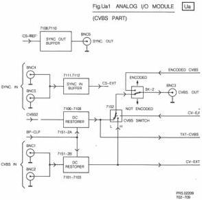

27

# MODULE Ua - ANALOGUE I/O CVBS + AUDIO PART

This part of module U provides selection of the various audio and video I/O configurations of the player including DC restoration of the external video input. See the block diagram in Fig.Ua1 for the CVBS circuitry and Fig.Ua2 for the audio part.

# Circuit description

# Sync out buffer

The comp. sync reference signal (CS-REF') will be used as sync out signal. This is realised via buffer circuit T 7109/7110 which will take care of the correct amplitude of the output signal (2Vpp) and the required output impedance. The sync out signal is available at BNC socket 6.

# Sync in buffer

External sync or CVBS signals can be connected to the input BNC sockets 4 and 5. Via the buffer circuit T 7111/7112 that sync signal will be used in the disc drive as CS-EXT, which will be applied to the reference source module (D). The input is high impedance in contrast to the output. The output is made low impedance because of a wanted insensitivity to disturbances.

# Fas-rel

A simple adjustable dc voltage (0V-8V) is used as FAS-REL signal, which will go to the ref. source module (D). This is done for adjustment of the phase relation between the incoming sync signal and the outgoing sync signal (horizontal shift). The range is from +4μs to -4μs and can be adjusted at the rear of the player.

# CVBS2 via dc restorer

The CVBS signal, CVBS2, from the video processor module (C) obtains a dc restoration during the black level on the backporch of the video signal. Via the CVBS switch circuit (IC 7152) the CVBS2 is available at the BNC 3 socket, if selected. Also the CVBS2 signal is, after the DC restoration, available as TXT CVBS signal which will be fed to the TXT part of module U (Uc).

DC restoration is driven by the BP-CLP signal from the video proc. module (C). This signal goes, via buffer T 7104, to the gate of FET 7108. This FET will conduct then, so at the moment of the pulse the dc level of the CVBS signal on the collector of T 7107 will be fed to the opamp IC 7151-2A. The opamp will create an output signal which makes the dc level of the CVBS signal on the collector of T 7107 zero (pin 3 of IC 7151-2A is connected to ground).

# CVBS IN via dc restorer

The 2 possible input sockets for CVBS IN (BNC 1 and BNC 2) are connected to each other. One of the 2 sockets can be applied as CVBS input for the disc drive itself and the other socket can be used to connect another disc drive in parallel. DC restoration takes place in exactly the same way as described in the previous section. The CVBS IN signal after DC restoration is available in the disc drive as CV-EXT signal and will be fed to the video proc. module (C) and to the CVBS switch. Then it is possible to have the external video signal directly available at the BNC3 socket depending on the control signal CV-E/I and the switch SK2.

# CVBS switch

The CVBS switch is realised with IC 7152 which consists of 2 identical circuits: a switchable differential amplifier with current source. The 2 input video signals are the internal and external video signal with dc restoration. Selection of one of these signals can be done with the CV-E/I signal at plug 29cU1.

If this signal is high, the current source in IC 7152-2B will function and the CV-EXT signal will be provided to the base of T 7105 and via SK2 be available on BNC3. If the CV-E/I signal is low the switch transistor in IC 7152-2B will be cut off. In that case the circuit in IC 7152-2A will function and connect the CVBS2 signal to the base of T 7105. The signal on the emitter of T 7105 is, after division of the signal by 2, used as feedback signal to have an amplification of 2. Switch SK2 under the backplate on the rear of the disc drive can select "encoded CVBS" or "non-encoded CVBS". Non-encoded means that the video signal will not be according the standard during special playing modes.

# Audio int/ext switches

Via cinch socket "EXT AUD1" (audio left channel) the audio signal arrives at pin 11 of switch IC 7551-4A which can be driven by the A1-E/I signal at pin 12. If the A1-E/I signal is high, the switch will be closed and the external audio 1 signal will via opamp IC 7552-2A be available at the AUD-1OUT cinch bus and SCART 3 output. The A1-E/I signal closes switch IC 7551-4A if the external audio signal is asked for but will at the same time, via inverter IC 7553-4A and D 6504, open switch IC 7551-4B. So the internal AUD1 signal is switched off.

If internal audio is asked for, the A1-E/I signal will be low, so switch IC 7551-4A is open and output pin 4 of inverter IC 7553-4A is high. So this high level is blocked by D 6504 and whether switch IC 7551-4B is closed or open depends on the AUD1ON and AUD2ON signal (high level results in closed switch).

Audio switching is arranged so that if either AUD1ON = 1 or AUD2ON = 1 then both channels are active but either may be internal or external depending on the status of A1-E/I and A2E/I.

For the audio 2 channel the same procedure is valid.

# Beep generator

A beep generator is realised with the aid of a simple nand gate (IC 7553-4C) and can be switched on via the A-SYNT signal from the drive processor module (R). If the A-SYNT signal is low, output pin 11 of IC 7553-4C will be high and no oscillation will arise. If A-SYNT is of high level output pin 11 depends on the other input level of the nand gate (pin 13). If this level is high too, pin 11 will become low. Then C 2511 will be discharged, so pin 13 becomes low and causes output pin 11 to be high. C 2511 will be charged then via R 3528 and input pin 13 becomes high, etc. This process continues until A-SYNT becomes of a low level.

The "beep" of adjustable amplitude (R 3530) may be injected to both channels.

CS 7 899