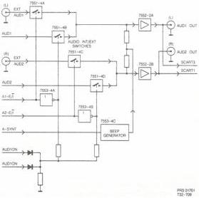
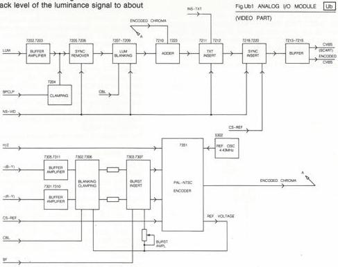

28

Fig. Ua2 ANALOG I/O MODULE Ub
(AUDIO PART)

# MODULE UB - ANALOGUE I/O VIDEO PART

This part of module U re-encodes -(R-Y) and -(B-Y) as a PAL chroma signal, mixes luminance and chroma and re-inserts text from disc if it is present. New syncs are inserted then and the resulting signal output goes as CVBS to SCART and encoded CVBS to the BNC outlet socket. See the block diagram in Fig. Ub1.

# Circuit description

# Luminance processing

On plug 9aU1 the luminance signal LUM arrives from the RGB demodulator module (B). The LUM signal will go via an adjustable gain buffer amplifier T 7201/7202/7203 to C 2204. The luminance signal will be clamped by the BPCLP signal. This signal is available on the gate of FET 7204 and will clamp the black level of the luminance signal to about OV.

The clamped luminance signal is present on the base of T 7205. Because the base of T 7206 is at GND level T 7205 will not pass on signals of negative level. In this way the syncs are removed and the luminance signal without syncs is available on the emitters of T 7205/7206. This removing of the syncs is blocked if the NS-VID signal (plug 6cU1) is high. Because this signal can let T 7217 conduct and pull the base of T7206 to a negative voltage level. The original syncs will remain in the luminance signal. The luminance signal will be buffered by T 7207 and is then present on the base of T 7209.

The signal at the base of T 7209 will be shorted to GND if FET 7208 is conducting. This is only possible via a high level of the CBL (composite blanking) signal, which only arises in the signal parts without luminance information (line syncs, frame syncs, burst period).

This blanking is blocked again by the NS-VID signal via T 7221.

The processed luminance signal will via emitter follower T 7209 go to the base of T 7211. In the meanwhile the luminance signal will be mixed with the encoded chroma signal via L 5202. Unwanted chroma in the luminance signal will be filtered out via C 2206, L 5202 and T 7223. The encoded chroma will be added to the luminance signal via T 7210 and T 7223.

To the signal at the base of T 7211 TXT information will be added via the T 7211/7212 circuit. The amplitude of the INS-TXT signal can be adjusted by potmeter R 3240. The insertion of TXT signals can be blocked too. If wanted, the NS-VID signal will make T 7222 conducting. In that case the INS-TXT is shorted to GND, so the video signal will pass T 7211 without TXT insert. The video signal will be available at the base of T 7213.

New syncs are now added to the signal at the base of T 7213 from the CS-REF signal (generated on the REFsource module (D)), via T 7216/7219. The amplitude of the offered sync signal can be adjusted with potmeter R 3263, via T 7220. Also, the insertion of CS-REF can be blocked by the NS-VID signal via T 7218.

CS 7 900

PRS 01700
T32-709