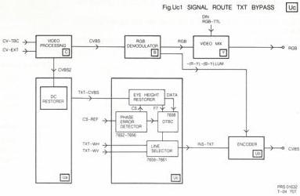

29

The complete video signal (CVBS) will go via T 7213 and the 2 emitter followers T 7214 and T 7215 to the outlet sockets SCART (pin 19) and BNC3 (CVBS out) resp.

At the moment there is non-standard video (during visible scan CLV) and the internal video is selected, the NS-VID signal (plug 6cU1, coming from the drive proc. module R) is high. If NS-VID is high the insertion of CBL, sync removing, sync insert and TXT insert will be blocked. The original luminance signal will be kept complete and is, with added chroma, directly available on the outputs.

# Chroma encoding

Encoding of the chroma signal is taken care of by IC 7351. The -(B-Y) signal and the -(R-Y) signal are coming from the RGB module (B). The -(B-Y) signal is available on pin 8cU1 and will go, via inverting and buffering stage T 7305/7311 with an adjustable amplitude (R 3315), to pin 12 of IC 7351.

The -(R-Y) signal will have the same process via T 7301/7310 and is present on pin 5 of IC 7351. A crystal oscillator (5302) is connected to IC 7351 to generate the chroma subcarrier frequency of 4.43MHz.

In IC 7351 itself generation of 2 carrier signals with a relative phase difference of 90° (pin 2 and 14) takes place.

A signal with half the line frequency (H/2, from the REF SOURCE module D) is provided to pin 8 of the IC (square-wave form). This signal will take care of a 0° or 180° phase shift of the subcarrier signal to have the (R-Y) signal phase shifted 180° every second line.

Via plug 10aU1 the CBL (Composite BLanking) signal is applied to MOSFETS 7302 and 7306. These fets can be made conducting by the CBL signal, which causes the (R-Y) and (B-Y) signals to be clamped to the voltage level of pin 10 of IC 7351 offered to the sources of the MOSFETS.

This is done to prevent chroma signals during the blanking period. In that period the dc-levels on pin 12 and 5 of the IC have the same level as the reference voltage of pin 10.

Because the colour burst also has to be generated, the BF (burst flag) signal will take care of pulse creation at the right moment. The amplitude of the pulse to be added is adjustable by potmeter R 3309 for the (R-Y) signal and by R 3319 for the (B-Y) signal. The dc levels will be added to the chroma difference signals via MOSFETS 7303 and 7307. The dc level is derived from the reference voltage of pin 10 (via T 7304 and T 7308).

The signals of the (R-Y) modulator and (B-Y) modulator will be added, clamped to the reference voltage of pin 10 by the CS-REF signal on pin 7, and made available as encoded chroma signal on pin 9 of the IC. This encoded chroma signal will be inserted in the original luminance signal.

# MODULE UC - ANALOGUE I/O TXT PART

In the VP415, to allow text or graphics from an external computer to be mixed with the video from the LV disc, the CVBS signal from the disc is demodulated to RGB. Text or graphics from the external source are added and the resulting signal output as RGB.

Because there is no way to pass the teletext signal from the disc by an RGB link, Module Uc provides an alternative path to the CVBS encoder. See the block diagram for the TXT bypass in Fig.Uc1.

Timing of the teletext signal is extremely important and so we find that Module Uc is built around a teletext video input processor, the so-called eye-height restorer, and a number of devices to ensure correct timing.

# Circuit description

CVBS from the disc enters IC 7651, pin 27. In IC 7651 the text data is separated from the CVBS signal and output at pin 15. Also the bit clock (6.9375MHz) is regenerated and output at pin 14.

The text data passes via IC 7657-8C, 7658, 7661, then is inserted (INS-TXT) into the CVBS, see diagram Ub.

IC 7658 is a variable length shift register, the length (number of stages) being determined by the setting of the dip switches and the time difference between reference sync (CS-REF) and the sync signal from pin 25 of IC 7651.

The setting of the switches is pre-loaded into ICs 7655 and 7656 at the commencement of each TV line by means of CS-REF and the sync signal from pin 25 of IC 7651.

# Selection of text source

In the general application of this board to the VP400 series of disc drives it is necessary to select text from CVBS or text from external (computer insertion) source as the presence of text from more than one source would confuse the decoder in the monitor.

The option of text insertion by either F-code or V-code is not available in the VP415. However, the components to allow this selection are still fitted. IC 7661 a multiplexer is present to effect this selection. Text from disc is selected when inputs 14 and 2 are both high. Input 14 is high when signal V/C-TXT, plug 20cU1, is high (text from disc allowed). When input 2 is high, is determined by line counter IC 7659, 7660. Text on disc may be present during lines 20, 21, 333 and 334 of the video signal.

CS 7 901