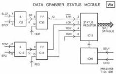

30

# MODULE W – DATA GRABBER AND CPU

# Function description

We may summarise the functions of the data grabber as :-

a) Collect serial data from the LV-ROM decoder.
b) Convert the two streams of serial data to parallel form.
c) Establish lock with the block structure.
d) Read the header.
e) When the desired header is seen, store that block and the two following blocks in RAM.
f) Signal to the CPU that the header and the following three blocks are ready.

During this sequence the data is unscrambled and if error flags are present the CPU enters a correction routine to recover corrupt data.

# Circuit description

The bus structure of the data grabber is as follows:

Table W1

Bus Function

|  A | Address from CPU.  |
| --- | --- |
|  B | Address from byte counter.  |
|  C | Ram and eprom address.  |
|  D | Data to/from CPU.  |
|  E | Data to/from RAM.  |
|  F | Data, descrambler byte from EPROM.  |
|  G | Data, descrambled data.  |
|  H | Data from shift registers (S/P).  |

# Bus linking

Certain of these buses can be interconnected as follows :

Table W2

|  Address bus C | ENW=0, to B bus | ENW=1, to A bus  |
| --- | --- | --- |
|  Data bus E | ENW=0, to G bus | ENW=1, to D bus  |

Serial data from the LV-ROM decoder (DLCF,DRCF) is placed in shift registers IC9,10,11,12 to appear as 4 parallel bytes (Hbus).

These 4 bytes are strobed out under control of signals SA0-SA3

which are decoded from B0,B1 of the byte counter. Each byte from the shift registers is EXORed with a byte from the descrambler EPROM (F bus) in IC's 16,17 to appear on the G bus.

From the G bus the bytes are transferred via buffer IC21 to the RAM IC 22.

The 4 header bytes are collected in the header register IC's

19,20 the remainder of the batch of three blocks are placed in the RAM. The CPU can now read the header information to determine if this is the start of the wanted sequence of blocks.

# Input circuit

Inputs from the LV-ROM decoder are via connector W1.

Table W3

|  DRCF | Data right | Pin 8  |
| --- | --- | --- |
|  DLCF | Data left | Pin 4  |
|  STR1 | Word strobe | Pin 5  |
|  STR2 | Byte strobe | Pin 7  |
|  CLCF | Bit clock | Pin 6  |
|  ERCF | Error flag right | Pin 3  |
|  ELCF | Error flag left | Pin 2  |
|  GND | Ground | Pin 1  |

The incoming signals are buffered in IC's 2,3.

# Sync detector

This circuit detects the sync pattern at the start of the data block. The pattern consists of a 12 byte sequence.

The detector comprises EPROM, IC 1 and D-Type flip flops IC's 6,7 and operates as a labyrinth in which, provided that the correct 96 bit pattern (8 x 12) is present an output pulse SNC will be developed. This pulse initiates the byte counter.

# Sync signal SYN

This signal is used to produce a byte count in sync with the incoming data.

When SYN=1 the count is set to 000h. The count commences when SYN=0. From this point on the byte counter generates addresses for the descrambler EPROM and the RAM. Owing to the fact that SYN is produced a little early it is delayed in IC 8 to correspond with the leading edge of ST1. Error window pulse ERWD.

If ERCF or ELCF are present indicating errors uncorrected in ERCO then by ORing these signals ERWD is produced. ERWD signifies that the error correction routine must be entered by the CPU.

ERWD is stored in flip flop IC 30. IC 30 is reset by HDR when a new header is recieved.

# Descrambler

The data in each block has a superimposed scrambling pattern which must be descrambled. This is achieved by EXORing byte by byte with a descrambling pattern from EPROM IC 24. Addresses for the EPROM are given by the byte counter (C bus). The byte counter forms part of a synchronous loop which ensures that the correct descrambler byte is output by the EPROM.

# In lock indication LCK

LCK indicates that the system is in lock with the block structure. LCK is derived from SYN and CNT, when the byte counter is counting 2351 bytes between sync patterns (IC's 13,14).

# Header pulse HDR

HDR=1 indicates that the 4 header bytes are being loaded in the header register IC 19,20 and in RAM IC 22. ERD (Enable Read Data) =1 inhibits the refreshing of the header when the header is found.

CS 7 902