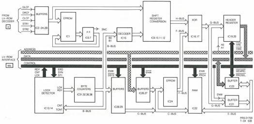

31

DATA GRABBER DATA PROCESSING MODULE

Wa

# Header register

Header bytes are loaded into the header register IC's 19,20 when HWE=0 (Header write enable). Header reading by the CPU is accomplished with HRE=0, IORD=0 and SEL4=0. The CPU can then determine if the header is from the desired data block.

# Byte counter

The byte counter uses 4 counters, IC's 31,32,36,38. It generates addresses for the descrambler EPROM and the RAM. The byte counter must be synchronised with the blocks. At the end of each sync pattern the counter is reset by SYN and so is rapidly pulled into lock. RDY indicates to the CPU that 3 blocks (3 x 2352) blocks are in the RAM.

# RDY (ready signal)

RDY informs the CPU that 3 blocks are in the RAM. RDY is generated when TCNT(Terminate count ) occurs ( 3 x 2352-1) from IC 35. The RDY circuit is built around IC's14,13 it is reset by RES.

# Read/write of header register and RAM

The read signal comes from the CPU. The write signal is DST2=0 for the ram, HDR for the header register.

# Status register

The CPU can read the status of the data grabber- port 34.

Table W4

|  Bit | Signal |   |
| --- | --- | --- |
|  0 | LCK | =1, Data grabber in lock  |
|  1 | RDY | =1, Three blocks in RAM  |
|  2 | HDR | =1, Header in register  |
|  3 | ERR | =0, Error is present  |
|  4-7 | Not used |   |

The status register is a tri-state octal buffer IC 18. It is enabled when ENA=0. ENA is derived from SEL4 and IORD in IC 66.

# Processor control lines to data grabber

Table W5

|  -MEMRD | Read RAM  |
| --- | --- |
|  -MEMWR | Write to RAM  |
|  -IORD | Read I/O ports  |
|  -ENA | Enable status register  |
|  -PRO4 | Chip select RAM 8000h - 9FFFh  |
|  -SEL4 | Chip select I/O ports 40h - 4Fh  |

# I/O ports

Table W6

|  -34h | Status register input  |
| --- | --- |
|  34h | Control register output  |
|  40h | Header register (Mins)  |
|  41h | Header register (Secs)  |
|  42h | Header register (Block)  |
|  43h | Header register (Mode)  |

# RAM (8k shared with CPU)

Table W7

|  8000h-8003h | Header block 1  |
| --- | --- |
|  8004h-8803h | Data block 1  |
|  8804h-8923h | CRC block 1  |
|  8924h-892Fh | Sync pattern block 2  |
|  8930h-8933h | Header block 2  |
|  8934h-9133h | Data block 2  |
|  9134h-9253h | CRC block 2  |
|  9254h-925Fh | Sync pattern block 3  |
|  9260h-9263h | Header block 3  |
|  9264h-9A63h | Data block 3  |
|  9A64h-9B83h | CRC block 3  |
|  9B84h-9B8Fh | Sync block 4  |

# Control register

Table W8

|  Bit | Function  |
| --- | --- |
|  1 | INTR=0 Reset interupt flip flops  |
|  0 - 4 | Not used  |
|  5 | RES=1 Reset LCK and RDY  |
|  6 | ERD=1 Read header of first data block  |
|  7 | ENW=1 CPU can write to RAM  |

# Sequence to get data from the disc

Table W9

|  1 | Make RES=1 to reset  |
| --- | --- |
|  2 | Wait for lock (LCK)  |
|  3 | Wait for header  |
|  4 | Make ERD=1 to read header when HDR arrives  |
|  5 | Wait for ready signal (RDY)  |
|  6 | Make ENW=1  |

CS 7 903