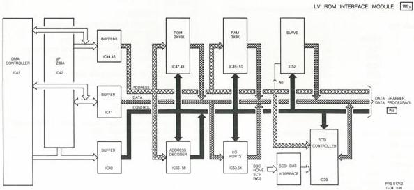

32

# CPU

The CPU section operates as the intelligent communications interface between the player and the host computer. It is built around a Z80A microprocessor and has 32k/bytes of ROM and 32k/bytes of RAM of which one 8k block is shared with the data grabber.

- Communication with the host computer is via a SCSI interface (Small Computer System Interface).
- Communication with the player is via a UART.
- Communications with the data grabber have been described.

An optional DMA controller for faster data transfer is catered for but this is not used in the VP415.

# Inputs to CPU

Commands in F-Code from host computer via SCSI.
Disc data from LV-ROM decoder via data grabber.
Acknowledgements from player via UART.

# Outputs of CPU

Disc dump data to host computer via SCSI.
F-Code commands to player via UART.

All three busses of the Z80A are buffered.
Address bus in IC's 44,45.
Data bus in IC 41.
Control bus in IC 40.

The RAM is arranged as 8kbyte blocks which are addressed by A0-A12. Selection of the desired block is by chip select lines -PR4 - -PR7 decoded from A13 - A15 in the 3 to 8 decoder IC56. The 3 to 8 decoder is enabled by -MREQ and gives active low outputs.

Chip enable of the ROM is by means of -PRO0 AND -PRO1 (IC 67).

# In/out port arrangement

The I/O ports are arranged in 8 blocks. Each block or device is allocated a chip select signal (-SEL0 - -SEL7) which is derived from 3 to 8 line decoder IC 57 using address lines A4 to A6. The decoder is enabled when the CPU is carrying out a machine port access (IOREQ=0) and A7=0.

The block identified by SEL3 is further divided into single bit I/O ports by decoding A0 - A3 in 3 to 8 line decoder IC 58 to give -SEL30 - -SEL37. This decoder is enabled by -SEL3.

# Read/write of I/O ports

When the Z80A accesses a machine port (I/O port) it does this by use of IOREQ with RD or WR. This separates I/O port access from memory access which uses MEMREQ and RD or WR.

# Single bit I/O ports

The input port is built around IC 53 and consists of 8 - D-TYPE flip flops. A word is loaded from the flip flops on the rising edge of the signal derived by ORing -SEL37 and -IORD.

Table W10

|  Bit | Signal  |
| --- | --- |
|  0 | ID0=1 interrupt from SCSI controller.  |
|  1 | ID1=1 interrupt from DMA controller.  |
|  2 | -  |
|  3 | -  |
|  4 | Baudrate=9600.  |
|  5 | MON=0 Monitor enabled.  |
|  6-7 | -  |

The output port is built around IC 53 and consists of 8 D-TYPE flip flops. A word is loaded to the flip flops from the data bus when the device is selected (-SEL34) and the write pulse (-IOWR) occurs.

Table W11

|  Bit | Signal  |
| --- | --- |
|  0 | INTR=0 Resets the interrupt flip flops.(IC 59).  |
|  1-4 | -  |
|  5 | RES=1 Reset data grabber.  |
|  6 | ERD=1 Enable read data.  |
|  7 | ENW=1 CPU access to RAM (8000h-9FFFh).  |

# Interrupt handling

The requirement is for two interrupt systems, one from the SCSI controller (INT0) and one from the DMA controller (-INT1). These two interrupts are combined in IC 67 and stored in J-K flip flop IC 59 to give an interrupt to the Z80A (-INT). IC 59 is reset when the interrupt has been serviced by -INTR from the output port IC 53.

CS 7 904