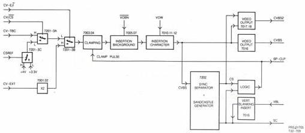

15

# MODULE C – VIDEO PROCESSING

See block diagram in Fig.C1. On the video processing module switching is made possible between internal video (CV–TBC), external video (CV–EXT) and composite sync depending on the demands. Composite sync can only be used in the case of internal video selection (video from the disc). Composite sync is necessary if the player is in "pause" or during "goto" actions. The index frame and index characters can be inserted in the video signal, if wanted. Sandcastle pulse generation takes place for RGB handling and clamp pulses are created for black–level clamping. Clamping of the video is necessary to enable insertion of the index information.

# Circuit description

# Switching

The CV–TBC signal (timebase corrected video) arrives on this module at plug 3C1 (from ETBC–B module H) and goes via C2001 to switch IC7201–3A. This switch is controlled by the CV/CS signal of the DRIVE PROCESSOR MODULE (R). This signal can turn over the switch between video and comp.sync. This comp.sync signal is the output signal of switch IC7201–3C which is controlled by the CSREF signal, obtained from the REF SOURCE MODULE (D). That signal takes care of the switch–over at the right time between 2 dc voltages, 4V at pin 5 of IC7201–3C (video level) and 3.3V at pin 3 of this IC (top sync level). So a comp.sync signal is created for a.o.th. the sandcastle generator.

The output signal of switch IC7201–3A (pin 14) goes to pin 2 of switch IC7201–3B. This switch is controlled by the CV–E/i signal from the DRIVE PROCESSOR MODULE (R) to select internal or external video.

The external video comes from the ANALOG I/O MODULE (U) and is available on plug 9C2 and goes via a 2x amplifier circuit (T7001 and T7002), to pin 1 of switch IC7201–3B. The output signal of this switch goes via emitter follower T7003 to the base of T7008. The black level of this video signal is clamped at 4V via T7004, of which the gate is driven by clamp pulses, created in IC7202 with the aid of some external components.

# Index insert

The video signal will obtain insertion of a grey level in the following circuit to get the index frame. This background level is realised by the VOBN signal at plug 5C1, coming from the DRIVE PROCESSOR MODULE (R). This TTL signal switches between 0V and 5V and goes, via T7005, to

the base of T7007. The insert is via the collector of T7007, on the emitter of T7008. Via emitter follower T7009, the video signal including the background is present on the emitter of T7009. At this point the index characters will be inserted. The index characters arrive at plug 6C1 as VOW signal from the DRIVE PROCESSOR MODULE (R). This signal is also switching between 0V and 5V and goes, via T7010 and T7011 to the base of T7012. In this circuit the character information will be made to the right voltage level, suitable to be inserted on the emitter of T7009 (characters at white level).

So on the emitter of T7009 the video signal, including index background and characters, is available.

# Video output

The CVBS signal on the emitter of T7009 goes, via T7016 and plug 1C2, to the RGB MODULE (B). This signal still contains the special burst signal, situated in the sync pulses. The ANALOG I/O MODULE needs the video signal too, but without the special burst signal. That signal is filtered out via T7017 and C2026, so via emitter follower T7018 the CVBS–2 signal (without special burst) is available at plug 6C2. FET T7017 is driven by the comp.sync pulse from IC7202.

# Sync separator + sandcastle generator

The composite sync signal is separated from the video signal in IC7202. The comp.sync signal suppresses via an OR circuit, realised by a few diodes and via nand gate 7203–4D the clamp pulses during vertical sync. The signal for creating the clamp pulses is the burstkey pulse which is separated from the sandcastle signal of pin 6 of IC7202, via T7014. The clamp pulses are needed for clamping of the black level of the video signal.

The sandcastle signal contains line frequency parts and frame frequency parts. The line frequency part is created in IC7202, output signal of pin 6. The frame frequency part (VBL signal) is added to it via T7015. The sandcastle signal can be adjusted to the correct horizontal frequency (15625Hz) with potmeter R3035.

In IC7202 a square waveform signal (15625Hz) is generated, duty–cycle 50%, and is available on pin 4. With the aid of circuit IC7203–4A,–4B and –4C a duty–cycle control of the block signal is made possible. See the timing diagram in Fig.C2. The output signal of this circuit is fed back to IC7202 (pin 2) and takes care of the horizontal blanking duration in the sandcastle signal. The width of the horizontal blanking is adjustable with potmeter R3045.

FIG.C1 VIDEO PROC. MODULE

CS 7 887