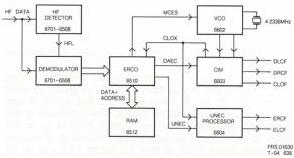

35

### LV-ROM decoder

The LV-ROM decoder accepts the signal from module Z (HFOUT2). This signal is of sinusoidal form and carries digital data for the host computer.

The data rate is 4.3218 mbits/sec but owing to the protection overhead carried the useable data rate is 153.6 kbytes/sec.

The family of IC's used in the LV-ROM decoder is common to the Compact Disc system and so is organised to output data in 16 bit words on two channels.

Data is output in serial form as - left (DLCF) and right (DRCF) with appropriate timing signals - Bit clock (CLCF), Byte clock (STR2) and word clock (STR1). This latter references 16 bit values which are the basic units in Compact Disc.

In addition LV-ROM outputs error flags (ELCF, ERCF) to indicate if uncorrected errors remain in the data.

LV-ROM DECODER MODULE

### Circuit description

The incoming signal from the deck is amplified (Ts6701, 6702, 6703, 6706) to give the required input level (1vpp.) then applied to the input of DEMOD (DEMODulator) IC6501. The signal is also applied to the HF level detector (Ts6530, 6531, IC6508).

When the signal is of adequate amplitude HFL, from 6508.14 enables DEMOD. This occurs when the signal is greater than 0.65Vpp.

The functions of DEMOD are as follows :

- a) To regenerate a bit clock in synchronism with the bit rate from the disc.
- b) To demodulate the data. (On the disc each byte is represented as a 14 bit word.)
- c) To output the data with corresponding timing signals.

The bit clock is formed as a phase locked loop with varicap diode 6540 as the control element.

### Signals from DEMOD are

Table X2

|  DADE | Data DEMOD to ERCO  |
| --- | --- |
|  FSDE | Frame sync DEMOD to ERCO  |
|  SSDE | Symbol (8 bit) sync DEMOD to ERCO  |
|  CLDE | Bit clock DEMOD to ERCO  |
|  CRI | Mutes ERCO if no data present  |

ERCO provides de-interleaving of the data, error detection, and error correction of up to two error bits in any word.

De-interleaving is achieved by storing the data as recieved from DEMOD in buffer RAM 6502 then picking out in the correct order.

Uncorrected errors are flagged on pin 36 of ERCO as UNEC (UNcorrected errors ERCO to CIM).

The parity bits are discarded in ERCO.

### The signals from ERCO are

Table X3

|  DAEC | Data ERCO to CIM  |
| --- | --- |
|  UNEC | Unreliable data ERCO to CIM  |
|  CLEC | Bit clock ERCO to CIM  |
|  FSEC | Frame sync ERCO to CIM  |

CLOX is the master clock from CIM to ERCO which determines the rate at which data is read from RAM 6502.

CIM (Concealment, Interpolation and Muting) separates the data into left and right streams (DLCF, DRCF) and again provides the necessary timing signals STR1, STR2, CLCF (Bit clock).

There are other functions built into CIM for the Compact Disc system which are not used in this application.

### UNEC descrambler

The error flags from ERCO do not correspond in time with the data leaving CIM. To restore the correct time relationship a further SAA7000 (CIM) is used, IC6604.

IC6604 provides error flags for both data streams.

Data- DLCF error flags ELCF.

Data- DRCF error flags ERCF.

### Frequency of CLOX

In the Compact Disc application of this chip set the bit clock (DEMOD) runs in lock with the data from the disc which itself runs at a continually varying speed. CLOX determines the sample play rate and operates as a fixed frequency master clock. The disc is driven at a rate to maintain the contents of RAM 6512.

In this Laservision application the disc (CAV) is driven at a constant controlled speed which may be locked to an outside reference by Genlock.

CIOX therefore must run in sync with the data rate from the disc.

Provision is made to pull CLOX to the precise frequency by varicap diode 6606. The control voltage for 6606 is developed from MCES (motor control error signal from ERCO). MCES is a variable mark/space ratio signal. The mark/space ratio is determined in ERCO by the difference between the bit clock (CLDE) and CLOX. MCES is integrated by IC6602-2a and controls 6606 via 6602-2b. D6605 limits the excursions to protect 6606.

CS 7 907