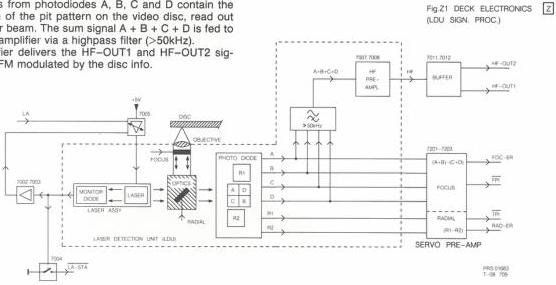
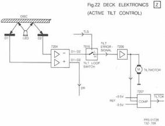

37

# MODULE Z - DECK ELECTRONICS

The Deck Electronics consist of the circuitry to process the signal from the LDU and the Active Tilt Control. The circuits are built on a PCB, situated under the optical deck chassis. The LDU is connected to this PCB by means of a flex-foil connection. For the block diagram of the LDU signal processing see Fig.Z1.

# Circuit description

# The laser supply

The Solid State laser is supplied by the +5V through a controllable DC amplifier. The laser emits part of the light to the optics and part to an internal monitor-diode. This diode measures the amount of light and feeds the monitor information back to amplifier T 7005 via T 7002, 7003. In this way, a constant current through the laser is realised. The monitor signal also drives switch T 7004, causing the LA-STA signal to go low when the laser has been switched on. This signal is fed to the drive processor module (R).

The signal LA switches, via T 7001, the controllable amplifier T 7005, thus the laser, on and off (LA low = off).

# The LDU signal processing

The LDU signal processing converts the signals from the photodiodes into drive signals to be processed further in the electronics of the player.

# - HF signal

The signals from photodiodes A, B, C and D contain the information of the pit pattern on the video disc, read out by the laser beam. The sum signal A + B + C + D is fed to the HF preamplifier via a highpass filter (>50kHz).

This amplifier delivers the HF-OUT1 and HF-OUT2 signals, both FM modulated by the disc info.

# - Radial signals

The radial fault signal on photodiodes R1 and R2 occurs when the laser spots are not exactly positioned on the tracks of the disc. In the servo preamplifier, the difference signal (R1-R2) represents the radial error signal RAD-ER. When the laser spot is exactly positioned on the track, a track position indication TPI is obtained from the servo preamp. The TPI signal is low when on track and high when the spot is off the track.

As soon as the TPI signal becomes high, the radial mirror in the LDU will be driven by the RAD-ER signal.

# The ATC circuit

The block diagram of the ATC circuit is shown in Fig.Z2. The signals of D1 and D2 are measured in IC 7204. Addition of the two signals gives a sign that a disc is present above the LDU. In this case DR (disc reflection) is high. Subtraction of the signals represents the error-signal (D1-D2), that is fed to the tilt loop switch T 7015. Signal TLS, coming from the Drive Module, is high when the ATC circuit has to become active (DR = high).

The tilt error signal is fed to amplifier IC 7206 which drives the tilt motor. As soon as the tilt motor voltage is within a range of + and - 0.5V, the TILTOK signal will be low, as a sign that the ATC is in a correct position.

# - Focus signals

The signals A, B, C and D are processed in the servo preamplifier to gain the focus error signal FOC-ER and the focus position indication FPI. Both signals drive the focus module (J) which focusses the objective onto the video disc.

The FOC-ER representing the deviation between objective and disc is composed by the difference signal (A+B) - (C+D).

The FPI signal is high when the objective is not focussed. As soon as focus is obtained, the FPI will go low and the objective is kept in focus by the FOC-ER signal.

CS 7 873