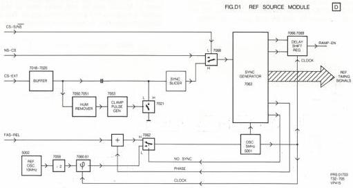

16

# MODULE D – REFERENCE SOURCE

The circuit on this module takes care of the generation of video timing signals necessary in the player. See block diagram in Fig.D1. These reference signals have to be very accurate in frequency and timing. There are three modes of operation:

1) Stand alone.

In this mode the 5MHz crystal is locked to the 10MHz crystal oscillator.

2) Composite sync external (CS-EXT).

In this mode the 5MHz crystal is locked to the signal CS-EXT.

3) Non standard composite sync (NS-CS).

In this mode the 5MHz crystal is locked to the signal NS-CS, coming out of the sandwich part via the analog I/O module U.

If no sync signals are provided in modes 2 or 3, the stand alone mode will function automatically.

# Circuit description

ad 1) The 5MHz crystal 5001 is locked to the 10MHz crystal 5002. Inputs 8D2 and 4D2 are high impedance. In this mode the devices in use are: 5002, 7059-2A, 7060-4A, 7061-2B, 7062-3A, 7061-2A.
ad 2) The 5MHz crystal 5001 is locked to CS-EXT (8D2). For this mode the select signal CS-S/NS is at +5V. In this mode the devices in use are: 7050,51,52,53,54,55,56,57 and 7068.
ad 3) The 5MHz crystal 5001 is locked to NS-CS (10D1), coming out of the sandwich part. This mode is selected if CS-S/NS is pulled to ground. In this case 7068 is in use.

The NS-CS signal comes via the analog I/O module (Ua) from the vid mix module (Y). The CS-EXT signal can be applied directly to the analog I/O module (Ua). The control signal CS-S/NS can drive a switch circuit to pass the NS-CS signal or the CS-EXT signal. This control signal comes from the VID MIX MODULE (Y) and will be available on this module via the analog I/O module (Ua). The switch circuit is realized with the aid of 3 NAND gates in IC7068.

If neither comp. sync signal is available, it will be detected by the sync generator IC7063 which creates the "no sync" signal at output pin 13 in that case. The no sync signal takes care of the functioning of the reference oscillator of 10MHz by driving switch IC7062-3A.

The CS-EXT signal can be a clean comp. sync signal or a complete CVBS signal. In case of a CVBS signal a sync slicer circuit (IC7054-7057) will derive a comp. sync signal from that signal. Fixing of the dc level of the external sync signal is also necessary. Therefore the signal goes via a "HUM remover" circuit (IC7050,7051) to remove the video content of the complete signal. The result is a clean comp. sync signal which takes care of triggering of a clamp pulse generator circuit (IC7053). This circuit creates pulses for clamping of the signal offered to the sync slicer, by switching FET T7021.

The sync signal input of the sync generator IC7063 can be seen as a "master" input to have the outputs related in phase. Phase comparison takes place in IC7063 and depending on the result an output signal PHASE is realised controlling the varicap (6013) voltage of the 5MHz oscillator.

An FAS-REL signal is provided to this module. This signal is created on the analog I/O module (Ua) and is a dc voltage adjustable between 0V and 8V with potmeter R3149 on module Ua. This signal can influence the horizontal shift of the outgoing video signal. So the video signal of the player can be related to a possible computer video signal. The control range is from +4us (0V) to -4us (8V).

See for greater detail of the timing the data sheet for the SAA1043.

Because of the necessary processing time of the video signal in the sandwich part, an equal delay time has to be realised in the player part. This is done with the variable length shift registers IC7066 and IC7069. The delay time created in IC7069 is determined by the address offered to this IC. The required address in case of the PAL system is mentioned in the table on the circuit diagram.

CS 7 888