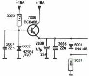
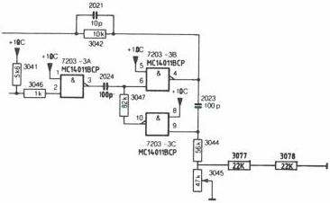
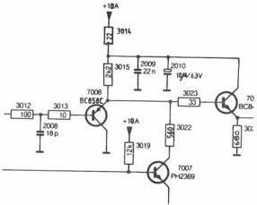

# VIDEO PROC C

|  Mod. level | Description | Reason | Mod. documents  |
| --- | --- | --- | --- |
|  4 | **Changed :** -R3007 was 130E becomes 120E 4822 111 90339 **Added :** -C2006 22N 4822 122 31797 -R3014 Fus car Flm rst 22E 4822 111 40847 -R3077 Chip rst 22K 4822 111 90251 -R3078 Chip rst 22k 4822 111 90251 | Amplification extern CVBS signal is to small | AHT 9198  |

CS 8 268