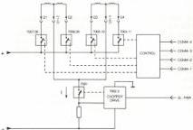
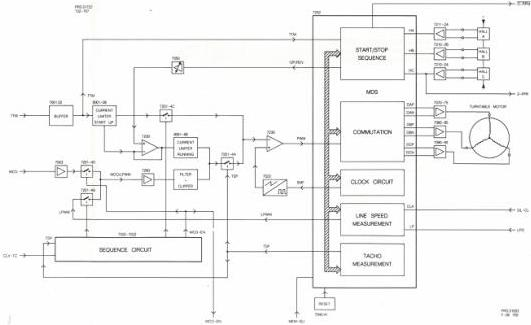

17

# Output signals:

FI

RAMP-EN

80-FH

TXT-WH

400HZPAL

TXT-WV

REFH

REFV

CBL

CS-REF

CLP

H/2

BF

field identification for genlock

ramp enable signal to ETBC-C module for phase measurement in tangential error circuit

80-FH = 1.25MHz signal to analog I/O module, not used in the VP415

teletext window horizontal to analog I/O module for txt insertion in the correct line

to analog I/O module (Ub), not used in the VP415

teletext window vertical to analog I/O module for txt insertion in the correct line. This signal is identical with REFV

horizontal reference signal, to drive proc.module (R) for hor. sync character insert, to the genlock module (G), and the analog I/O module (Ua) for loop through to the vid mix module (Y)

vertical reference signal, to drive proc.module (R) for vertical sync character insert and VBL generation. This signal is identical with TXT-WV. composite blanking signal, to analog I/O module (U) for loop through to the vid mix module (Y) and is used for blanking

composite sync reference signal to analog I/O module (Ua) and the video processor module (C)

clamp pulse to analog I/O module
PAL 8kHz pulse to analog I/O module (Ub) for 0"-180" phase switching of the chroma subcarrier for R-Y burst flag signal to the analog I/O module

# MODULE E - SLIDE DRIVE

The slide drive module, see the block diagram in Fig.E1, controls the slide drive motor. The function of the slide drive motor is to move the LDU under the disc in such a way that the tracks can be read out in an optimal way.

# Circuit description

The slide is driven by a stepping motor. Each step moves the slide by about 50 track spaces. The motor is driven by means of pulses on COMM 1-4 and SL-PWR which switches the motor coils between holding and moving power levels via an astable multivibrator with transistors 7002, 7003.

The drive signals are provided by the drive processor, module R.

Fig.E1 SLIDE DRIVE MODULE

# MODULE F - MOTOR + SEQUENCE

The circuits in this module take care of the drive of the turntable motor. See servo block diagram and block diagram in Fig.F1.

The turntable motor is of the brushless type provided with Hall elements. The main groups on the board are:

-The MDS-IC 7202. This IC takes care of the communication between the motor and other circuits and delivers the required drive voltages to the output amplifiers of the motor.

-The Hall elements which are continuously passing the position of the motor via comparators to the MDS-IC.

-The logic circuits around transistors 7020-7022 which are controlling the motor with regard to the several conditions like start, brake, motor control and current limiting.

-The pulsewidth modulator IC 7230 which is converting the drive voltages into a duty cycle controlled input pulse for the MDS-IC

-The output stages which are supplying the required drive currents to the motor coils. This currents are derived from the commutating voltages supplied by the MDS-IC.

# Circuit description

For a proper functioning of the turntable motor, several input signals are required:

-TTM, the turntable motor on signal which is "H" during start and play conditions and delivered by the drive processor.

-MCO, a duty cycle controlled pulse which is originating from the GenLock Module and only active in the locked position.

-CLV-TC, a logic "H" signal, present during track crossing at CLV discs.

-MEM-SU, Memory start up, a logic "H" signal in case of focus loss on CLV disc in search mode. The last tacho information is then stored in a memory.

# Start condition

In start condition the TTM signal is "H" and is via the buffer amplifiers 7001-7002 fed to the MDS-IC. As long as the motorspeed is below 1500 RPM, the output signal TSP of the tacho circuit in the MDS-IC is "L" which causes switch 7201-4C to be open. The TSP signal is also fed to the sequence circuit and causes that 7021 is blocked. The collector voltage is then "H" and switch 7201-4C is closed. The "H" voltage from TTM is fed via 7201-4C to pulse-width modulator 7230-2A. This results in a low duty cycle and causes speeding up of the motor. The charge current of 2031 is limited by the diodes 6001-6002. The pulse-width modulator 7230-2A compares the control voltage with a sawtooth signal derived from the clock circuit in IC 7202. The frequency is about 17.6 kHz. The sawtooth shaped voltage is obtained by the generator consisting of transistor 7023, capacitor 2030 and the resistors 3029-3031. It will be clear, that the duty cycle decreases when the d.c. control voltage increases.

Fig.F1 MOTOR+SEQUENCE MODULE

CS 7 889