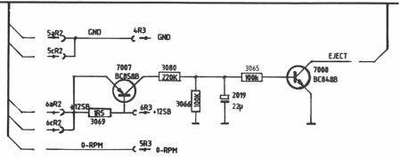

# DRIVE PROC MODULE R(CONT'D)

|  Mod. level | Description | Reason | Mod. documents  |
| --- | --- | --- | --- |
|  7 | Added : -R3064 1E5 4822 111 30487 -R3065 220k 4822 111 90197 -R3066 100k 4822 111 90214 -R3067 100k 4822 111 90214 -C2019 10μF 5322 124 21749 -TS7007 BC858B 5322 130 41983 -TS7008 BC848B 5322 130 41982 | Finger protection circuit front loader | AHT9030  |

CS 8 278