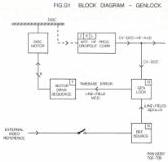
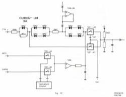
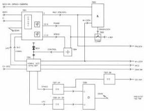

18

# Running condition

As soon as the motor is running, 12 p/rev. pulses are applied from 30IC-7202 to the base of transistor 7050. This causes the input voltage on 5-IC7230 to increase from about 2.7V up to 3.2V. After the opamp and the diodes 6061-6066 a small part of the output voltage is fed to switch 7201-4D. As soon as 1500 RPM is reached, the TSP-signal becomes "H" and switch 7201-4D will close. At the same time transistor 7021 starts conducting and switch 7201-4C will open. This means a lower input voltage at the pulse width modulator and the motor will not accelerate anymore.

# Frequency control

When the motor has reached a speed of 1500 RPM and TSP is "H", switch 7201-4B is closed via resistor 3021 and diode 6022. Now the motor control will take place with the aid of the LWPM signal and the phase compensation network IC 7260-2B. The output will be combined with the running current limiter signal.

# Phase control

In running condition TSP has become "H", capacitor 2020 is charged and after about 0.5 sec transistor 7020 starts conducting and the collector voltage will drop. Switch 7201-4B opens and there is no frequency control anymore. At the same time transistor 7022 is blocked and due to the high collector voltage, switch 7201-4A is closed. From this moment on MCO-EN becomes also "H" and the motor control is taken over by the MCO-signal.

In case of CLV-track crossing, which occurs in CLV-search mode, the CLV-TC-signal becomes "H", which means that there is only frequency control by the LPWM-signal.

# Active braking

When TTM becomes "L", TSP is "L" too. Switch 7201-4A will open and 7201-4C will close. A lower voltage is now given to the pulsewidth modulator input. Upon motor stop, all driver inputs are disabled.

# MODULE G - GENLOCK

The purpose of this module is to establish lock in both frame and line between the disc and the sync generator on the reference source module (D). Thanks to the fact that the player is equipped with RGB, synchronization of the colour subcarrier is not required. Locking is possible at the internal sync generator which is highly accurate. In this way it is possible to place, before the disc is turning, text on the screen which is coupled to a sync to which the disc will also be synchronized later. Moreover, the video signal of the disc can be synchronized to an external video or sync signal. See the block diagram in Fig. G1. Locking is done by adapting the rotational speed of the disc or the motor control via module F. In this way the phase of the read-out video (CV-DOC) is controlled.

The time required by the player for synchronization can be divided into two parts. First the internal sync generator should synchronize to the external signal. This can take maximum 7 s. However, this action can already be started when the disc is still standing still. Next the disc should synchronize to the internal sync generator. This may take 3 s. When the phase of the external sync is reset arbitrarily during the program, the internal sync generator should fall into step and the disc should again lock to the internal sync. This may take a total of 7 s because both actions take place simultaneously.

# Circuit description

For the blockdiagram of the genlock module, see Fig.G2. Sync separator IC 7205 runs on a VCO with a centre frequency of 4.5MHz and control element varicap diode 6014.

IC 7205 outputs:

20 LPO Line pulse out, a line sync pulse obtained from input signal CV-DOC (Composite video dropout corrected).
19 M-LOCK CV-DOC/VCO locked.
15 MCO Motor control out, duty cycle proportional to speed error.
4 DEM-BK Burst key pulse from demodulated video (CV-DOC).
8 Frame pulse.
3 4.5MHz clock.
6 Composite syncs derived from CV-DOC.

In IC 7205 the phase comparison between the line pulses of the disc (derived from CV-DOC) and the line frequency pulses of the reference (4.5 MHz divided by 288) takes place. The phase difference will cause a change in the duty cycle of the MCO signal. The MCO signal is the input signal for the motor control. The line pulses of the disc are thus phase-coupled to the reference.

The signals from pins 4,6 and 8 are combined (IC 7206-2B, T 7018) to give DEM-BK. The pulses are suppressed around the vertical sync pulse.

The signal from pin 8 is stretched in one shots 7207-2A, 7207-2B to give DO-INH (dropout inhibit during the lines occupied by the Manchester codes).

# Establishing lock

Lock is established in speed and phase by adjusting the voltage applied to varicap diode 6014. This occurs in defined stages. During lock-in (crash lock) the phase control (outputs 13,14 IC 7201) is disabled by:

a) MCO-EN until 1500 rpm is reached, and

b) Line and frame lock has been achieved (INL2, pin 1,IC7201).

When this stage is reached MCO-EN and INL2 indicate "OK" and via ICs 7203-4B, 7203-4C and transistors 7004, 7005 the clamp voltage is removed from the phase correction network consisting of transistors 7006, 7007 and IC 7204-2A. Phase control outputs 13 and 14 of IC 7201 are now effective. Dependent on the required phase correction the charge on capacitor 2008 will be changed by charging more via transistor 7006 or discharging more via transistor 7007. The charging charge on capacitor 2008 will via OPAMP ICs 7204-2A and 7204-2B adapt the varicap voltage on diode 6014 and thus the reference frequency of IC 7205.

IC 7201 operates by comparing FI (field identification) and RSFH from the reference module (D) with LPO and DEMV (obtained from CV-DOC in IC 7205).

The comparison is obtained by counting GLC pulses. Speed corrections are made in a decreasing series of steps, from +/- 1.8% to +/- 0.1%. The dividend of the variable divider is dependent on the number of line pulses which is counted between the leading edges of the field identification of the disc (DEMV) and the field identification of the reference (FI). When the phase difference is maximum the disc goes with a speed of 1.8% relative to the nominal to the reference. As the phase difference decreases, the relative speed decreases too. In this way frame lock is realized. The next action is the synchronization of the line pulse. If genlock IC 7201 establishes that there no longer are line pulses between the field identification pulses of the disc video and the reference, the FRLOCK signal becomes active (high level, 5V). This is followed by permanent comparison between the line pulses of the disc and the line pulses of the reference.

Fig.G2 GENLOCK MODULE G

CS 7 890