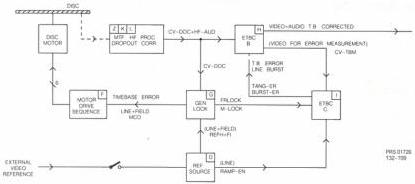
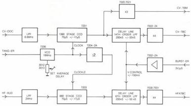

19

# MODULE H - ETBC B

This module is part of the electronic timebase correction system (see block diagram overall timebase correction, fig.H1).

It is comprised of two CCD (charge coupled devices) delay lines to effect coarse correction (+/- 17 micro secs) and two variable LC delay lines to effect fine correction (+/- 50 nano secs).

Video and audio signals are treated separately, in parallel. IC 7201 is the CCD for the video channel and IC 7203 the CCD for the audio channel (see fig.H2).

On this module the timebase of the drop-out corrected composite video (CV-DOC) is corrected. This is necessary because of the presence of several tolerances (disc, centring, motor) which cause variations on the line phase of the video signal read. The variations can be about +/- 17us compared with the reference. This is unacceptable for video processing, so correction is needed. In the previous players the correction was realised in a mechanical way, the tangential mirror. In the new-generation disc drives the tangential mirror is not applied anymore. The timebase is corrected electronically. The ETBC B module will have the timebase corrected comp. video signal (CV-TBC) as output signal for further processing on the vid proc module (C).

Also it is necessary to have timebase correction of the audio signal (HFAUD), which is realised too on this module. As result the output signal is the timebase corrected hf audio signal (HFATBC).

Control of the time delay is by means of TANG-ER and BURST-ER both from the ETBC C module (I).

# Circuit description

# Video timebase correction

The CV-DOC signal from the video do corr module (L) arrives at this module on plug 2H2 and goes, via emitter follower T7013 and a lowpass filter (≤6.6MHz), to the input of the CCD memory IC 7201. Lowpass filtering is necessary to prevent aliasing effects in the CCD. The video signal will get a time delay in the CCD depending on the frequency of the clock signal offered. The clock oscillator is connected to pin 14 of IC 7201 and functions as a voltage controlled oscillator (VCO), IC 7206. The voltage offered is the measured error signal (TANG-ER) created on the ETBC C module (I). The TANG-ER signal is present on plug 4H1 of this module. As the clock rate is determined by TANG-ER, so the time the signal is delayed in the CCD's is also determined by TANG-ER. This shows that as TANG-ER is a measure of the time error, a loop is set up which will compensate for timebase errors within the measuring accuracy of TANG-ER.

The frequency of the clock oscillator output signal is inversely proportional to TANG-ER and has a centre frequency of about 19MHz.

Referring to the anti aliasing phenomenon mentioned above it will be seen that low pass filtering of the input signal is required to eliminate any frequencies greater than half the clock rate.

In the CCD IC 7201 a flipflop is situated which acts as a :2 divider. The 2 output signals of this flipflop go to the 2 x 680 stages shift register, so the complete delay is 1360 stages for the video signal (see fig.H2). Reading by the CCD memory happens every positive going edge of the flipflop output signals Q and Q. For the timing of the internal flipflop, see Fig.H3.

FIG.H1 BLOCK DIAGRAM - OVERALL TIMEBASE CORRECTION

FIG.H2 ETBC B MODULE

PRS.01726
132-166

CS 7 891