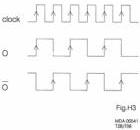
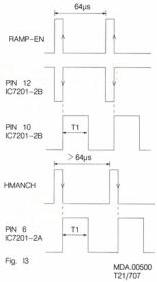

20

The timebase corrected output signal of IC 7201 goes, via T7018, to T7020 to have a 3x amplification. The signal continues from the collector of T7020, via emitter follower T7021, to plug 7H1 as CV-TBM signal. For the system this signal is the measuring signal to create the error signals on the ETBC C module (I). On that module a comparison takes place of the measure signal and the reference signals. So this is the feedback loop of the timebase correction mechanism.

At the same time the signal of the emitter of T7018 goes, via T7017, to a steep lowpass filter (≤7MHz). This filter is realised by coils L5002...L5008 and the varicap diodes D6005...D6010. The filter circuit provides the video signal with a delay time of 200ns and depending on the voltage on the varicap diodes another +/- 50ns. This depends on the BURST-ER signal. Lowpass filtering is also necessary to prevent switching noise of the CCD.

In the video path there is some high frequency loss in the CCD. This is compensated for with a high pass network in the emitter of T7022 giving a rising response of about 6dB between 2 and 4MHz. From this network the video signal will be available on plug 2H1 as CV-TBC signal, via amplifier T7023 and emitter follower T7024.

The BURST-ER signal is present on plug 5H1 and goes, via potentiometer R3134, to the + input of opamp IC 7202-2A. From the output of this opamp the signal goes, via voltage follower IC7202-2B, to the varicap diodes of the variable LC delay line.

Dependent on the voltage offered the delay time will change, and this with a maximum of the above-mentioned +/- 50ns. The functioning of this circuit can be seen as a fine correction of the timebase errors.

# Audio timebase correction

The HF-AUD (high frequency audio) signal from the HF PROC module (K) arrives this module (H) on plug 1H2. The audio signal goes, just like the video signal, via a lowpass filter to a CCD memory IC (IC7203). The audio signal needs timebase correction too.

The clock drive for the shift register is driven by the clock signal coming from flipflop IC7204-2A. The input signal of the flipflop is realised by the same VCO as used for the video path.

The flipflop IC7204-2A is used as :2 divider. The clock frequency can be half the value because of the lower number of stages used (680 instead of 1360). The time delay will be the same as for video, but the passband of the audio signal is lower.

The output signal of CCD IC7203 goes, via emitter follower T7026, to a lowpass filter (≤2.3MHz) to filter the switching noise.

This LC filter functions also as variable delay line with the aid of the varicap diodes 6013. The varicap diodes are controlled by the BURST-ER signal. The output signal of IC7202-2A, derived from the BURST-ER signal, goes, via C2059, potentiometer R3122 and emitter follower T7029, to the varicap diodes. The controlled time delay differences will have the same value as for the video signal. Via amplifier stage T7030 and emitter follower T7031 the timebase corrected hf audio signal is available on plug 9H1 as HFATBC signal.

# MODULE I - ETBC C

This module is part of the electronic time base correction system (see block diagram overall timebase correction, fig.H1). Its primary function is to measure the timebase error and provide coarse (TANG-ER) and fine (BURST-ER) correction control signals to module H. To give the required accuracy, error measurement is made at two levels of precision.

The CV-TBM signal is coming from the ETBC-B module (H) and is the composite video signal for measuring the timebase error.

See Fig.I1 for the block diagram of this module.

Coarse measurement is obtained from comparison of syncs in CV-TBM and the RAMP-EN signal. The RAMP-EN signal is the reference timing signal from the REF SOURCE module (D). Fine error measurement is obtained from the special burst, a 3.75MHz signal during sync pulses. This inserted signal can only be found in the video signal from the disc.

# Circuit description

# Tangential error detector

For the circuit diagram of the tangential error detector, see Fig.I2.

CV-TBM applied to pin 9, IC 7203 (synchronization IC) is passed through an internal low pass filter and the syncs are separated. From these a line sync signal is obtained (HMANCH, pin 20 of IC 7203). From this signal a constant length pulse is obtained by one shot IC 7201-2A. In a similar way a pulse of the same duration is obtained from RAMP-EN (from module D). See the timing diagram in Fig. I3 (pulse width T1=33μs).

Comparison of the relative timing of these signals in 7202-2A, 7202-2B, gives a current in one of the collectors of 7004, 7005 which is proportional to the time error. See the timing diagram in Fig.I4 (pulse width T2=4.7μs), assuming that the disc video and hence the HMANCH signal derived from it has a longer timebase than the reference (also see fig. I3). This may e.g. occur when the disc turns too slowly.

CS 7 892