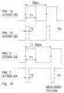
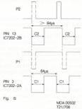
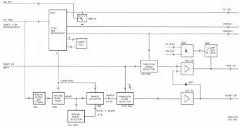
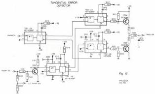
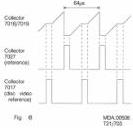
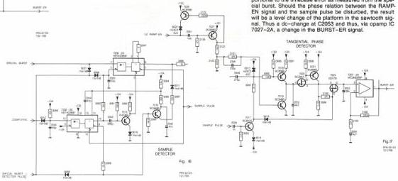

21

In Fig.14 output pulses P1 and P2 are drawn with dotted lines because these signals are only present when clear input pins 3 and 13 resp. are "high" (C1 and C2). These inputs are not constantly high but dependent on the outputs of one shots IC 7201-2A and -2B. See Fig.15 for the actual timing.

The timing figures show that a positive pulse remains (P2). Via T7005 it will see to a discharge of C2015. As a result the dc level of the TANG-ER signal will rise via buffering by IC 72072B. In this way adaptation of the timebase correction takes place, in the sense that the throughput time of the video signal is reduced.

FIG.11 ETBC C MODULE

C2015 will be charged for too short a period time of the disc video relative to the reference. Charging will take place by the negative pulses (P1) and T7004. The dc-level of the TANG-ER signal will drop. As a result the throughput time of the video on module H will be lengthened.

# Special burst separator + gate

From CV-TBM the special burst is extracted by T7001, L5001, C2005, and is, via emitter follower T7002, available at the source of FET 7003. The special burst signal is gated by the syncs from pin 6, IC 7203 at T7003.

T7011, T7012 act as a 'special burst presence' detector, the collector of T7012 going high if a special burst is present.

The special burst is applied via T7029, T7014 to input 4, IC 7206-2A.

# Sample detector

The sample detector, see Fig.16, sees to delivery of a sample pulse signal which is an accurate measure for the frequency of the disc video. This is realized by looking to exactly the same zero crossing of the special burst signal each line time.

The special burst signal is tied to one shot IC 7206-2A, pin 4. Pin 6 of this IC will change over to a high level as soon as pins 4 and 5 are high and pin 3, reset input, is high too. The latter will be realized via one shot IC 7206-2B and T7015. The input signal of this IC is the comp. sync signal derived from the disc video. This comp.sync signal thus triggers one shot IC 7206-2B, which delivers in its turn a defined pulse at pin 10. Via T6215 this pulse sets one shot IC 7206-2A free. Dependent on the pulse time at pin 3, which is determined by C2042 and R3081, one shot IC 7206-2A will be reset (low level at pin 3). One shot IC 7206-2A will be active after release at pin 3 and will give a pulse at pins 6 and 7 at the next zero crossing of the special burst signal. T7016 ensures the selection of the correct zero crossing with respect to the line sync.

# Tangential phase detector

The RAMP-EN signal of REF SOURCE module D is tapped by means of resistors R3127 and R3128 and goes to the tangential phase detector circuit, see Fig.17. The RAMP-EN pulse goes to the base of T7027 which is incorporated in a one shot circuit, formed by T7027 and T7028. The output pulse of this one shot goes to the base of T7019 and will let this T7019 conduct at high level thus discharging C2052. The output signal of IC 7206-2A, pin 7, is via C2049 present on the collector of T7017 as sample pulse signal.

The sample pulse signal indicates exactly where a fixed zero crossing of the special burst signal is situated. The frequency of the sample pulse signal can be seen as an accurate measurement of the line frequency of the disc video signal. Via R3094 this pulse is present at the base of T7018 and will let this T7018 conduct in case of a low level. As a result C2052 will be charged via R3097. This causes a certain sawtooth signal on C2052. The total picture of charging and discharging can be seen in Fig.18.

This sawtooth signal goes via T7020, T7021 to the source of FET T7023. This FET T7023 sees to sampling out of the platform level in the sawtooth voltage. This voltage level will be present at C2053 then. When the zero crossing of the special burst takes place, T7023 is turned on loading a new voltage into C2053. The value across C2053 is proportional to the timebase error as measured from the special burst. Should the phase relation between the RAMP-EN signal and the sample pulse be disturbed, the result will be a level change of the platform in the sawtooth signal. Thus a dc-change at C2053 and thus, via opamp IC 7027-2A, a change in the BURST-ER signal.

CS 7 893