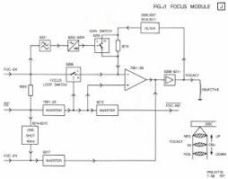
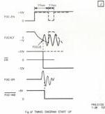
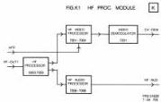

22

It is important that timebase correction is disabled during the start-up sequence until motor lock (M-LOCK) and frame lock (FRLOCK) has been reached. D6018/6019,T7024/7025 are used to clamp TANG-ER to a mean value until this moment. This mean value is realized with the aid of R3118/3119/3120 and T7026.

IC 7203 also provides the CL-VID, HMANCH and VMANCH signals. These signals are necessary for decoding the manchester codes present in the video signal from the disc. CL-VID (clipped video) is only present during a few lines in the vertical blanking. The CL-VID signal is suppressed during most of the video lines by the DO-INH signal (drop-out inhibit from the genlock module G) via T7009 and T7010.

# MODULE J - FOCUS

The function of the focus module is to move the objective in starting condition up to such a position that the laser beam is focussed on the disc and to keep the spot focussed under all play conditions.

# Circuit description

The block diagram of the focus circuit is shown in fig.J1. The objective is driven by amplifier transistors 6208-6211, which supply a positive or negative voltage FOCACT. Negative means that the objective is driven upwards to the disc and positive means that the objective is pulled downwards. The range of the objective movement is approximately 5mm.

When the player is started up (motor not yet turning), the focus enable signal FOC-EN is low and the focus position indication signal FPI from the deck electronics is high, resulting in 0 V on the objective (see timing diagram Fig. J2). As soon as the driving module detects a disc reflection (DR), a correct slide position SPI and a laser on LA-STIA the FOC-EN will go high. When FPI is still high, the drive voltage for the objective becomes negative causing the objective to go upwards. This movement is slowed down because of the feedback through filters 2006, 2007, 3015, 3016, 3017. Switch 6205 is still open, which means that there is maximum gain (low negative feedback).

When the objective focusses the laser beam onto the disc, the FPI signal will go low, causing the focus loop switch (transistor 6206) to close and after that the focus indication signal FOC-IND to go low. FOC-EN remains high. At the same time switch 6205 will be closed, which causes more negative feedback and as a consequence less gain. The FOC-IND low signal is applied to the drive module as a command that the turntable can be started. The objective is then driven by the focus error signal FOC-ER and is kept in focus by a negative voltage of average -1V on amplifier output 6208-6211.

When focus is found, the FPI will stay high and the drive module switches the FOC-EN to low after 0.5 sec. The drive voltage becomes 0V and the objective will move downwards. After 0.2 sec the FOC-EN will become high again and will move the objective upwards. This sequence is repeated 5 times. If no focus is found, the player is switched to stand by.

If there is a minor disturbance in the reflection, FPI and consequently also FOC-IND will become high for a short moment.

The positive pulse on FPI causes a negative drive voltage on the objective and without protection the objective should move upwards. The function of one shot transistors 6214-6215 is to prevent this. The positive FPI pulse triggers the one shot and keeps via collector of 6214 the FOC-EN signal low and via 6217/6010 the drive voltage at 0V during 40 ms. During this time the objective will not move.

The FOC-ER signal is fed through a low pass filter with transistor 6201 to an AC/DC converter with transistor 6204 and diode 6001. The DC voltage drives the gain switch in the feedback circuit of the output stage. As soon as the FOC-ER signal increases up to a certain AC level, the AC/DC converter switches the gain switch to high gain of the objective drive. The increasing error current through the objective then causes an audible noise in the LDU. When a low FOC-ER signal occurs, the circuit switches to low gain, resulting in a smooth objective drive.

# MODULE K - HF PROCESSING

The h.f. signal of the disc will be splitted up into a video and an audio signal in this module. See block diagram in Fig.K1. The h.f. signal goes to the h.f. video processor section. After a highpass filter an adaptation of the frequency response will take place there by means of the MTF voltage. This is necessary dependent on the read-out diameter of the disc. The corrected h.f. video signal will be demodulated in IC 7201. After filtering and amplification output signal CV-DEM will be available for further processing at module L (drop-out correction).

The h.f. signal also goes to the h.f. audio processor where the audio is filtered out by means of a lowpass filter. Output signal HF-AUD will be timebase corrected at module H.

# Circuit description

The h.f. signal is first filtered by LC circuit 5003, 2014 and 2015. The h.f. signal will be used for the video part from the collector of transistor 7005. Therefore filtering is necessary by highpass filter (>2 MHz) 2004, 2005, 2006 and 5001. Via amplifier stage 7002, 7003 and 7004 the h.f. video signal is available on the collector of transistor 7004. In the collector circuit of 7002 an LC circuit is situated, tuned to a frequency of 8 MHz.

The LC circuit will be damped more or less depending on the value of the MTF signal. So the MTF signal will via transistor 7001 take care of adaptation of the frequency responses.

Demodulation of the h.f. video signal takes place in IC 7201-2A with an adjustable output amplitude with the aid of potentiometer 3043. At point 16 of IC 7201-2A the demodulated video is available which will give a composite video signal (CV-DEM) after lowpass filtering (<5MHz) and amplification by IC 7201-2B at point 6k2 of the module.

The h.f. audio signal will be obtained from the emitter of transistor 7005. This is realised with the amplifier stage in feedback mode, 7006, 7007 and 7008 and the lowpass filter (<2MHz) in the collector circuit of transistor 7006. This filter consists of 5004 and 2019, 2020 and 2021. The h.f. audio signal is available at point 1k1 of the module.

CS 7 894